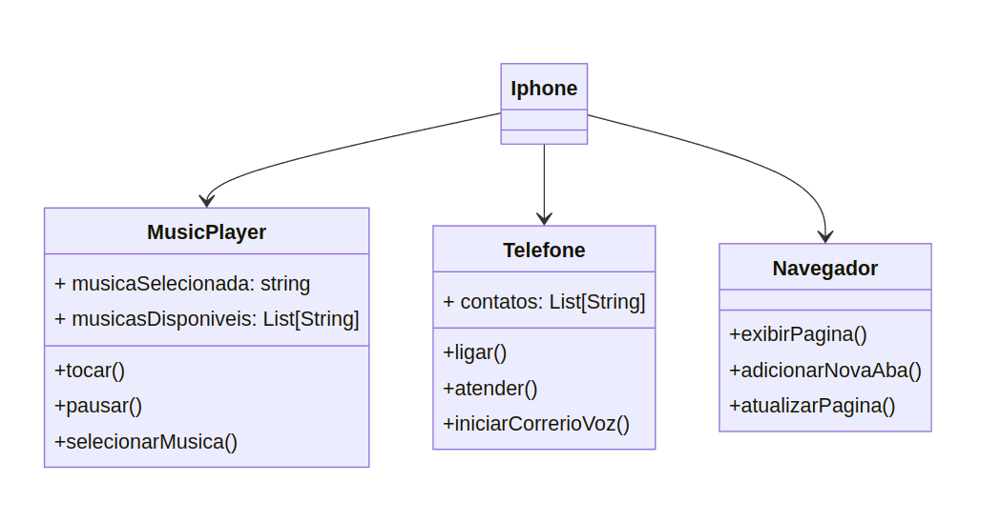

# Diagramação de Classes do iPhone UML




---
O Diagrama foi criado com o auxilio do website: [mermaid.live](https://mermaid.live)

Código utilizado:
```
classDiagram
    class Iphone {

    }

    class MusicPlayer {
        + musicaSelecionada: string
        + musicasDisponiveis: List[String]
        
        + tocar()
        + pausar()
        + selecionarMusica()
        }


    class Telefone {
        + contatos: List[String]

        + ligar()
        + atender()
        + iniciarCorrerioVoz()
    }

    class Navegador {

        + exibirPagina() 
        + adicionarNovaAba()
        + atualizarPagina()
    }

    Iphone --> MusicPlayer
    Iphone --> Telefone
    Iphone --> Navegador
```

